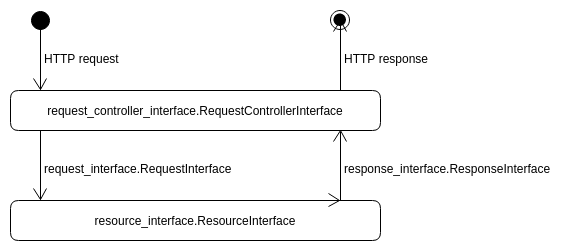

============================================
Asynchronous Server Gateway Interface (ASGI)
============================================

.. contents:: :local:

Introduction
============

The ASGI module consists of the following classes:

1. Request
    A request object holds all information about the client requesting a resource.
2. Response
    A response contains all data which the user will receive.
3. Resource
    A resource executes the action which the user requests.
4. ResourceController
    A resource controller manages the database connection and routes the user to the correct resource.

When the server receives a request, the information contained by the request will be converted into a :class:`~tedious.asgi.request_interface.RequestInterface`
by a :class:`~tedious.asgi.resource_controller_interface.ResourceControllerInterface`,
which then passes the request further to a :class:`~tedious.asgi.resource_interface.ResourceInterface`.
The resource will execute the requested actions and return a :class:`~tedious.asgi.response_interface.ResponseInterface`
which in the end will be outputted by the ResourceController.

Example
=======

Creating your own resource
--------------------------

.. literalinclude:: ../examples/auth_resource.py
    :language: python3

Using a different Framework than Starlette
------------------------------------------

.. literalinclude:: ../examples/custom_asgi.py
    :language: python3

Classes
=======

Request
-------

.. autoclass:: tedious.asgi.request_interface.RequestInterface
    :members:

Response
--------

.. autoclass:: tedious.asgi.response_interface.ResponseInterface
    :members:

Resource
--------

.. autoclass:: tedious.asgi.resource_interface.ResourceInterface
    :members:

Resource controller
-------------------

.. autoclass:: tedious.asgi.resource_controller_interface.ResourceControllerInterface
    :members:

Starlette
=========

Tedious offers a complete implementation of Starlette_.

.. _Starlette: https://www.starlette.io/

Implemented classes
-------------------

.. autoclass:: tedious.asgi.starlette.Request
    :members:

.. autoclass:: tedious.asgi.starlette.ResourceController
    :members:

