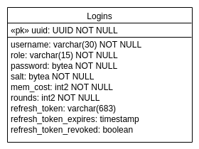

==============
Authentication
==============

.. contents:: :local:

Introduction
============

On sign in the user retrieves an access token. These tokens consist of three parts, the header, payload and signature, all three separated by dots.
The header and payload are key value constructs (JSON), encoded in base64.
The signature is created by encoding the header and payload with a private key, which obviously has to be kept private.
The matching public key can be distributed to verify the token.

------
Header
------

- 'typ': type of token, should be 'JWT'
- 'alg': algorithm used to encode signature
- 'kid': identifies public key

-------
Payload
-------

- 'exp': Expiration date
- 'nbf': Not before, datetime at which token becomes valid for use
- 'iss': Issuer of token
- 'aud': Audience, service for which token is meant to be used by
- 'iat': Time at which token was issued
- additional claims like role, name, uid

-------------------
Authentication Flow
-------------------
1. User signs in and retrieves a token.
2. User decodes payload, validates iss and exp.
3. User requests profile data, **sends token along as HTTP Authorization header with type bearer**, token gets verified using public key, public key is determined by kid
    iss, exp, nbf, aud is validated.

--------------
Refresh tokens
--------------

To stop the platform from continuously asking the user to authenticate and limiting the lifespan of an access token,
refresh tokens are sent along on sign in.
A refresh token is a random string which does not contain any information. When an access token dies, the user can send their refresh token
to the api and retrieve a fresh access token after their activity is checked for malicious actions.
Refresh tokens have to be stored securely and there has to be the option of revoking refresh tokens.

------------
Logins table
------------

The login table used for authentication looks like the following. Any data which belong to a user should be referenced to the uuid of this table.

Examples
========

.. _registering_user:

---------------------------------------
Registering, authenticating and removal
---------------------------------------

.. literalinclude:: ../examples/auth.py
    :language: python3
    :lines: 5-24

-------------
Access tokens
-------------

.. literalinclude:: ../examples/auth.py
    :language: python3
    :lines: 5-14, 18, 21-27

--------------
Refresh tokens
--------------

.. literalinclude:: ../examples/auth.py
    :language: python3
    :lines: 5-14, 18, 28-34

Classes
=======

---------
Requester
---------

.. autoclass:: tedious.auth.auth.Requester
    :members:

-------
JWTAuth
-------

.. autoclass:: tedious.auth.jwt.JWTAuth
    :members:

----
Auth
----

.. autoclass:: tedious.auth.auth.Auth
    :members:

----------
Exceptions
----------

.. autoclass:: tedious.auth.auth.UserNotFound

.. autoclass:: tedious.auth.auth.InvalidPassword

.. autoclass:: tedious.auth.auth.RefreshTokenNotFound

.. autoclass:: tedious.auth.auth.RefreshTokenExpired

.. autoclass:: tedious.auth.auth.RefreshTokenRevoked

.. autoclass:: tedious.auth.jwt.InvalidToken

